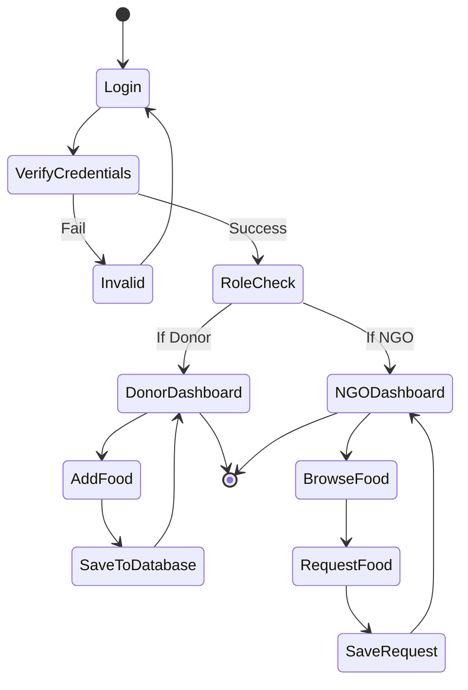
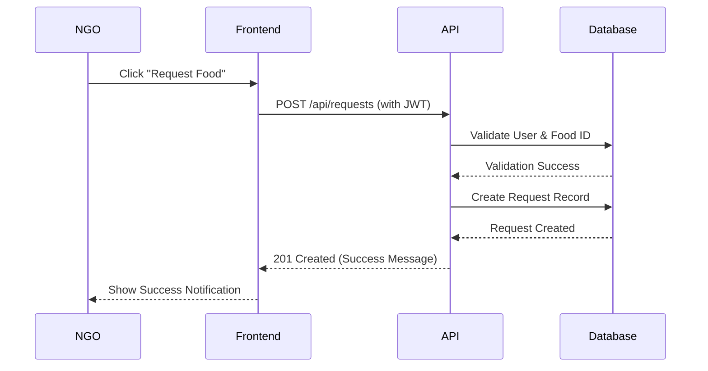
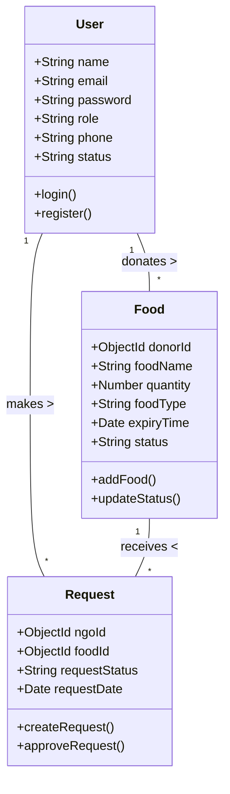
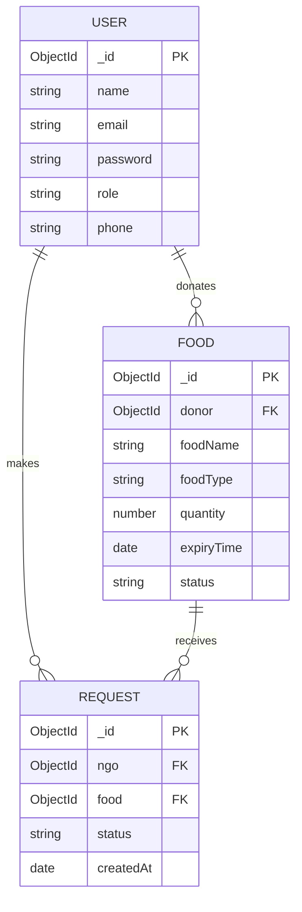

# HNDIT4052 – Programming Individual Project

> **Note to Student:** Please copy this content into Microsoft Word and apply the following formatting as per your guidelines:
> - **Paper Size:** A4
> - **Font Style:** Times New Roman
> - **Font Size:** Headings 14pt (Bold), Subheadings 12pt (Bold), Body 12pt
> - **Line Spacing:** 1.5
> - **Text Alignment:** Justified
> - **Margins:** Left 1.5 inches; Right, Top, Bottom 1 inch
> - **Page Numbering:** Roman (i, ii, iii) for preliminary pages, Arabic (1, 2, 3) from Chapter 1.
> - **Mermaid Diagrams:** You can render the provided Mermaid diagrams using an online tool like [Mermaid Live Editor](https://mermaid.live/) or by using a markdown viewer, and then copy the generated images into your Word document.

---
*(Start of Report)*

# TITLE PAGE

**Project Title:** Food Donation Management System
**Student Name:** [Your Name]
**Index Number:** [Your Index Number]
**Course Code:** HNDIT4052
**Course Title:** Programming Individual Project
**Institution Name:** [Your Institution Name]
**Submission Date:** [Date]

---

# ACKNOWLEDGEMENT

I would like to express my sincere gratitude to everyone who supported me throughout the development of the Food Donation Management System. 

Firstly, I thank my project supervisor for their continuous guidance, invaluable feedback, and encouragement, which helped shape this project into a success. I also extend my appreciation to the faculty members for equipping me with the necessary technical knowledge and skills required to undertake this project.

Finally, I am deeply thankful to my family and friends for their constant moral support and motivation during the challenging phases of this development process.

---

# ABSTRACT

Food wastage is a critical global issue, occurring simultaneously with widespread hunger and food insecurity. The Food Donation Management System was developed to address this disparity by providing a centralized web-based platform that connects food donors, such as restaurants and individuals, directly with Non-Governmental Organizations (NGOs). 

The problem stems from the lack of efficient communication channels between those with surplus food and those in need, leading to unnecessary waste. To solve this, the developed solution offers a secure, role-based platform where donors can easily list available food, and NGOs can browse and request these donations. The system allows tracking the status of donations from "Pending" to "Picked Up" and "Delivered". 

Built using the modern MERN stack (MongoDB, Express.js, React.js, Node.js), the system ensures high performance, scalability, and a responsive user interface. Key technologies include JWT for secure authentication and RESTful APIs for seamless frontend-backend integration. The successful outcome of this project is a fully functional web application that simplifies the donation process, thereby helping to reduce food waste and support communities in need.

---

# TABLE OF CONTENTS

*(Note: Update page numbers in Word after formatting)*

1. Title Page .......................................................................... i
2. Acknowledgement ................................................................... ii
3. Abstract .......................................................................... iii
4. Table of Contents ................................................................. iv
5. List of Figures ................................................................... v
6. List of Tables .................................................................... vi
Chapter 1: Introduction .............................................................. 1
Chapter 2: Literature Review ......................................................... 3
Chapter 3: System Analysis (SRS) ..................................................... 5
Chapter 4: System Design ............................................................. 8
Chapter 5: Implementation ............................................................ 12
Chapter 6: Testing & Evaluation ...................................................... 15
Chapter 7: Conclusion & Future Work .................................................. 18
References ........................................................................... 19
Appendices ........................................................................... 20

---

# LIST OF FIGURES

Figure 4.1: Use Case Diagram
Figure 4.2: Activity Diagram
Figure 4.3: Sequence Diagram
Figure 4.4: Class Diagram
Figure 4.5: Entity Relationship (ER) Diagram
Figure 5.1: Login Page GUI *(Add Screenshot)*
Figure 5.2: Donor Dashboard GUI *(Add Screenshot)*
Figure 5.3: NGO Dashboard GUI *(Add Screenshot)*

---

# LIST OF TABLES

Table 3.1: Hardware Requirements
Table 3.2: Software Requirements
Table 6.1: Test Cases for Authentication
Table 6.2: Test Cases for Food Donation Module
Table 6.3: Test Cases for Request Module

---

# CHAPTER 1: INTRODUCTION

## 1.1 Background of the Project
In many parts of the world, a significant amount of food is wasted daily by households, restaurants, and event organizers, while simultaneously, a large portion of the population struggles with hunger. The Food Donation Management System is a web application designed to bridge the gap between food donors and charity organizations (NGOs). By leveraging modern web technologies, the system provides a reliable platform to list surplus food, facilitating quick distribution to those in need.

## 1.2 Problem Statement
Currently, there is a lack of efficient, centralized platforms to facilitate the transfer of surplus food from donors to charities. Donors often do not know whom to contact when they have excess food, and NGOs struggle to find consistent food sources. Manual communication via phone calls or fragmented social media groups leads to delays, resulting in food spoilage and inefficient distribution.

## 1.3 Objectives
- To design and develop a web-based platform connecting food donors with NGOs.
- To implement a secure role-based authentication system for Donors, NGOs, and Administrators.
- To provide a user-friendly interface for donors to post food details and track their status.
- To enable NGOs to view available donations and submit requests easily.
- To establish a scalable backend architecture using Node.js and MongoDB to handle data efficiently.

## 1.4 Scope of the Project
The system covers the end-to-end process of food donation management. It includes user registration and authentication, a donor dashboard for managing food listings, and an NGO dashboard for browsing and requesting food. The system tracks the status of donations (Pending, Picked Up, Delivered) and includes administrative features for overseeing the platform. The application is designed to be responsive and accessible via standard web browsers.

## 1.5 Limitations
- The system currently lacks real-time GPS tracking for delivery personnel.
- It requires an active internet connection to function.
- In-app real-time chat functionality is not yet fully implemented, relying on external contact methods provided in user profiles.

---

# CHAPTER 2: LITERATURE REVIEW

## 2.1 Existing Systems or Similar Applications
Several applications attempt to solve the food wastage problem globally. Platforms like "Olio" connect neighbors to share surplus food, while "Feeding America" uses large-scale logistics to distribute food to food banks. However, many of these systems are either highly localized to specific countries or too complex for small-scale local NGOs and individual restaurant donors to use efficiently. 

## 2.2 Technologies Used in the Industry
Modern web development heavily relies on JavaScript-based stacks due to their asynchronous nature and performance benefits. The industry standard for building dynamic Single Page Applications (SPAs) is React.js, which allows for reusable UI components. For backends, Node.js with Express.js is widely used for building scalable RESTful APIs. MongoDB, a NoSQL database, is preferred for its flexibility in handling unstructured data, making the MERN (MongoDB, Express, React, Node) stack a dominant choice in the industry.

## 2.3 Comparison of Existing Solutions
Unlike broad community-sharing apps like Olio, this Food Donation System focuses specifically on the Donor-to-NGO pipeline, ensuring that large quantities of surplus food are handled professionally. It simplifies the user interface and removes unnecessary features that complicate the donation process, offering straightforward status tracking tailored for local operational efficiency.

---

# CHAPTER 3: SYSTEM ANALYSIS (SRS)

## 3.1 Functional Requirements
- **User Authentication:** Users must be able to register and log in as either a Donor, an NGO, or an Admin.
- **Donation Management:** Donors must be able to add, view, and update the status of food donations.
- **Request Management:** NGOs must be able to browse available food listings and send requests to donors.
- **Status Tracking:** The system must allow the update of donation statuses (e.g., Pending, Picked Up, Delivered).
- **Dashboard Access:** Users must be redirected to role-specific dashboards upon successful login.

## 3.2 Non-Functional Requirements
- **Security:** User passwords must be hashed, and API endpoints must be protected using JSON Web Tokens (JWT).
- **Performance:** The system should load quickly and handle concurrent user requests efficiently.
- **Usability:** The user interface must be intuitive, clean, and responsive across different screen sizes.
- **Reliability:** The database must ensure data integrity and prevent unauthorized access to sensitive information.

## 3.3 Input/Output Requirements
- **Inputs:** User registration details (Name, Email, Password, Role), Food details (Food Name, Quantity, Food Type, Expiry Time, Location).
- **Outputs:** Display of available donations in a card format, success/error notification messages, and status updates for requests.

## 3.4 Hardware & Software Requirements

**Table 3.1: Hardware Requirements**
| Component | Minimum Requirement | Recommended |
| :--- | :--- | :--- |
| Processor | Intel Core i3 or equivalent | Intel Core i5 or higher |
| RAM | 4 GB | 8 GB or higher |
| Storage | 1 GB Free Space | 5 GB Free Space (SSD) |
| Internet | Required | Required (Broadband) |

**Table 3.2: Software Requirements**
| Component | Specification |
| :--- | :--- |
| Operating System | Windows 10/11, macOS, or Linux |
| Web Browser | Google Chrome, Mozilla Firefox, or Edge |
| Frontend Environment | Node.js (v14+), React.js |
| Backend Environment | Node.js, Express.js |
| Database | MongoDB (Local or Atlas) |
| IDE | Visual Studio Code |

---

# CHAPTER 4: SYSTEM DESIGN

*(Note: Render the following Mermaid codes into images and paste them here)*

## 4.1 Use Case Diagram

```mermaid
usecaseDiagram
    actor Donor
    actor NGO
    actor Admin

    usecase "Register/Login" as UC1
    usecase "Add Food Donation" as UC2
    usecase "View Own Donations" as UC3
    usecase "Update Donation Status" as UC4
    usecase "View All Available Food" as UC5
    usecase "Request Food" as UC6
    usecase "Track Request Status" as UC7
    usecase "Manage Users" as UC8

    Donor --> UC1
    Donor --> UC2
    Donor --> UC3
    Donor --> UC4

    NGO --> UC1
    NGO --> UC5
    NGO --> UC6
    NGO --> UC7

    Admin --> UC1
    Admin --> UC8
```

## 4.2 Activity Diagram



## 4.3 Sequence Diagram (Donation Request Process)



## 4.4 Class Diagram



## 4.5 Database Design (ER Diagram)



---

# CHAPTER 5: IMPLEMENTATION

## 5.1 Programming Language Used
The entire application was built using **JavaScript (ES6+)**. By utilizing JavaScript on both the frontend (React) and backend (Node.js), the project maintains a consistent language ecosystem, which streamlines development and data formatting (JSON).

## 5.2 Tools and Technologies
- **Frontend:** React.js, React Router DOM, Axios, Context API, CSS3.
- **Backend:** Node.js, Express.js.
- **Database:** MongoDB, Mongoose ODM.
- **Security:** JSON Web Tokens (JWT), bcrypt.js (for password hashing).
- **Development Tools:** Visual Studio Code, Git, Postman (for API testing).

## 5.3 Key Features
- **Secure Authentication:** JWT-based login system that automatically attaches tokens to API headers via Axios interceptors.
- **Role-Based Routing:** Protected routes that redirect users to their specific dashboards based on their role (Donor vs. NGO).
- **Interactive Dashboards:** Donors can easily list food with details (quantity, type, expiry), while NGOs have a clean interface to view and request donations.
- **Status Badges:** Color-coded status indicators (Pending, Picked Up, Delivered) improve the user experience.

## 5.4 Code Structure (Brief Explanation)
The project utilizes a clean, modular folder structure:
- **`frontend/src/`**
  - **`pages/`**: Contains main route views (`Login.js`, `Register.js`, `DonorDashboard.js`, `NGODashboard.js`).
  - **`components/`**: Reusable UI elements (`AddFoodForm.js`, `DonationCard.js`, `PrivateRoute.js`).
  - **`services/`**: Abstracts all API calls (`api.js`, `authService.js`, `donationService.js`).
  - **`context/`**: Manages global state (`AuthContext.js`).
- **`backend/`**
  - **`models/`**: Mongoose schemas defining database structure.
  - **`controllers/`**: Business logic for handling requests.
  - **`routes/`**: API endpoint definitions.
  - **`middleware/`**: JWT validation and error handling.

## 5.5 GUI Screenshots
*(Please take screenshots of your running application and insert them here)*
- **Figure 5.1:** Login / Registration Page
- **Figure 5.2:** Donor Dashboard showing "Add Food" form.
- **Figure 5.3:** NGO Dashboard showing available donation cards.

---

# CHAPTER 6: TESTING & EVALUATION

## 6.1 Test Plan
The testing strategy focused on ensuring data security, reliable API communication, and a bug-free user interface. Testing was conducted in phases: individual component testing, API endpoint validation using Postman, and end-to-end user flow testing in the browser.

## 6.2 Test Cases

**Table 6.1: Test Cases for Authentication**
| Test Case ID | Description | Expected Result | Actual Result | Status |
| :--- | :--- | :--- | :--- | :--- |
| TC-01 | Login with valid credentials | Redirects to correct Dashboard | Redirected to Dashboard | Pass |
| TC-02 | Login with invalid password | Display "Invalid Credentials" error | Error displayed | Pass |
| TC-03 | Register with existing email | Display "Email already exists" | Error displayed | Pass |

**Table 6.2: Test Cases for Food Donation Module**
| Test Case ID | Description | Expected Result | Actual Result | Status |
| :--- | :--- | :--- | :--- | :--- |
| TC-04 | Donor adds new food item | Item saved and appears in list | Saved and displayed | Pass |
| TC-05 | Add food with empty fields | HTML5 validation prevents submission | Form blocked | Pass |

**Table 6.3: Test Cases for Request Module**
| Test Case ID | Description | Expected Result | Actual Result | Status |
| :--- | :--- | :--- | :--- | :--- |
| TC-06 | NGO views food listings | Fetches data and displays cards | Cards displayed | Pass |
| TC-07 | NGO clicks "Request Food" | API call succeeds, success message | Success message shown | Pass |

## 6.3 Types of Testing Performed
- **Unit Testing:** Individual UI components (e.g., `AddFoodForm`) and backend controllers were tested for correct behavior in isolation.
- **Integration Testing:** Ensuring the React frontend correctly communicates with the Express backend APIs via Axios, including token transmission.
- **Black-box Testing:** Performing actions as an end-user without looking at the internal code to ensure the system meets requirements.
- **White-box Testing:** Reviewing backend route logic and database queries to ensure data is updated accurately.

## 6.4 Results and Analysis
All core functionalities successfully passed the testing phase. The JWT authentication effectively blocked unauthorized access to protected routes. Data flow between the MongoDB database, Node backend, and React frontend was smooth, with no noticeable lag, proving the MERN stack's efficiency for this application.

---

# CHAPTER 7: CONCLUSION & FUTURE WORK

## 7.1 Summary of the Project
The Food Donation Management System successfully addresses the core issue of food wastage by providing an intuitive platform for Donors and NGOs. By utilizing the MERN stack, the application achieved a modern, responsive, and secure architecture capable of handling user authentication, food listings, and request management. 

## 7.2 Achievements
- Developed a fully functional SPA (Single Page Application) using React.
- Implemented secure, role-based access control isolating Donor and NGO capabilities.
- Created robust RESTful APIs with efficient MongoDB schema designs.
- Established a clean, user-friendly UI with color-coded status tracking.

## 7.3 Limitations
- Real-time notifications are not implemented; users must refresh to see updates.
- The system lacks an integrated mapping service for location visualization.
- No dedicated role for delivery personnel to update transit statuses dynamically.

## 7.4 Suggestions for Future Improvements
- **Google Maps Integration:** Implement map APIs to show exact pickup locations and calculate distances between Donors and NGOs.
- **Real-Time WebSockets:** Use Socket.io to push live notifications when a food item is requested or approved.
- **Mobile Application:** Develop a React Native version of the application for easier access on the go.
- **Delivery Module:** Add a third user role for volunteer drivers to claim delivery tasks and track them via GPS.

---

# REFERENCES
1. React Documentation. (n.d.). *React – A JavaScript library for building user interfaces.* Retrieved from https://reactjs.org/
2. Node.js Foundation. (n.d.). *Node.js Documentation.* Retrieved from https://nodejs.org/en/docs/
3. MongoDB Inc. (n.d.). *MongoDB Documentation.* Retrieved from https://docs.mongodb.com/
4. Axios Contributors. (n.d.). *Axios - Promise based HTTP client for the browser and node.js.* Retrieved from https://axios-http.com/
5. Mozilla Developer Network (MDN). (n.d.). *JavaScript Guide.* Retrieved from https://developer.mozilla.org/en-US/docs/Web/JavaScript/Guide

---

# APPENDICES

## Appendix A: Source Code Snippets

**Snippet 1: Protected Route Implementation (React)**
```javascript
const PrivateRoute = ({ children, allowedRoles }) => {
  const { user, loading } = useAuth();
  if (loading) return <div>Loading...</div>;
  if (!user) return <Navigate to="/login" />;
  if (allowedRoles && !allowedRoles.includes(user.role)) {
    return <Navigate to="/" />;
  }
  return children;
};
```

**Snippet 2: User Schema (Mongoose)**
```javascript
const userSchema = new mongoose.Schema({
  name: { type: String, required: true },
  email: { type: String, required: true, unique: true },
  password: { type: String, required: true, select: false },
  role: { type: String, enum: ["donor", "ngo", "admin"], default: "donor" }
}, { timestamps: true });
```

## Appendix B: User Manual
1. **Starting the Application:** 
   - Start MongoDB service locally.
   - Run `npm start` in the `backend` folder.
   - Run `npm start` in the `frontend` folder.
2. **Registration:**
   - Navigate to `http://localhost:3000/register`.
   - Fill in details and select "Donor" or "NGO" as your role.
3. **Donating Food (Donor):**
   - Log in and go to your Dashboard.
   - Fill out the "Add Food" form and click Submit.
4. **Requesting Food (NGO):**
   - Log in and navigate to the NGO Dashboard.
   - Browse the list of available food and click "Request Food" on desired items.

*(End of Report)*
